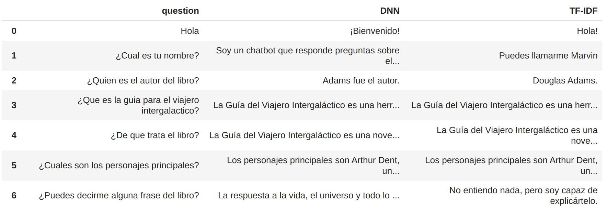
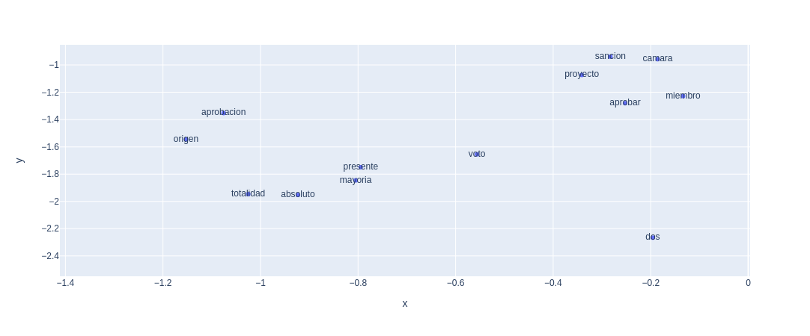
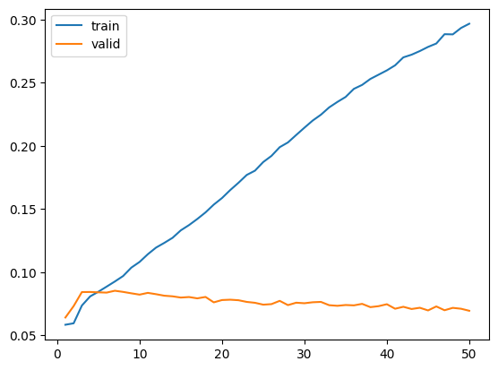
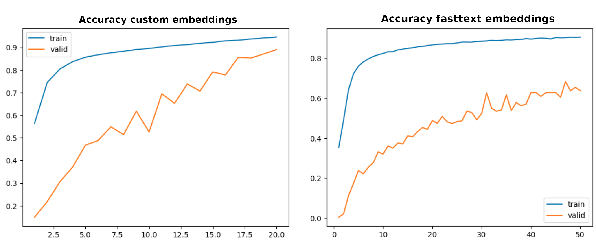

# Procesamiento de lenguaje natural - CEIA
## Repositorio de trabajos realizados para la cátedra Procesamiento de lenguaje natural de la CEIA
### Alumno: Gonzalo Gontad
### Cohorte: 8va
### Año: 2023

# Ejercicio 1
## Vectorización y comparación de documentos
El objetivo de este ejercicio es desarrollar herramientas de codificación, vectorización y comparación de documentos.

Con las herramientas desarrolladas se procedio al procesamiento de un corpus de 3 documentos y la comparación mediante similaridad coseno.

Notebook: [Ejercicio1](https://github.com/Gonzalogontad/NLP_CEIA/blob/main/Ejercicio1/1a%20-%20word2vec.ipynb)

# Ejercicio 2
## Chatbot basado en reglas
El objetivo de este ejercicio es desarrollar un chatbot basado en reglas que responda consultas especificas de un tema.

Para este desarrollo se utilizo un dataset creado con ChatGPT sobre el libro "Guía del Viajero Intergaláctico" de Douglas Adams.

La implemetación está compuesta de las siguientes etapas:
- Tokenización y lematización con spaCy + stanza en español.
- Vectorizacion one-hot encoding.
- Entrenamiento de un modelo DNN de tres capas.
- TF-IDF + similitud coseno.

Finalmente se implemento una interfaz de usuario para interactuar con el chatbot y se compararon las respuestas de ambos predictores (DNN y TF-IDF) como se muestra en la siguiente figura. En los ensayos no se observo una diferencia significativa entre ambos predictores.

Notebook: [Ejercicio2](https://github.com/Gonzalogontad/NLP_CEIA/blob/main/Ejercicio2/Ejercicio2.ipynb)

# Ejercicio 3
## Custom embedddings
El objetivo de este ejercicio es crear embeddings customizados de palabras basadas en un corpus de texto.

En este ejercicio se utlizo como dataset el texto de la constitución Argentina.

En la creacion de los embeddings se implementaron las siguiuientes etapas:
- Tokenización y lematización con spaCy + stanza en español.
- Embeddings con Gensim ( Skip-Gram y dimension 300).
- Reduccion de dimensionalidad con T-SNE para visualizar los embeddings.

El embedding entrenado fue capaz de capturar relaciones entre palabras asociadas a los procesos democraticos y politicos de la constitucion. En la siguiente figura se observa un ejemplo de las relaciones capturadas asociadas a la palabra "voto"

Notebook: [Ejercicio3](https://github.com/Gonzalogontad/NLP_CEIA/blob/main/Ejercicio3/Ejercicio3.ipynb)

# Ejercicio 4
## Predicción de próxima palabra
En este ejercicio se debia implementar un modelo que a partir de una secuencia de entrada pueda predecir la proxima palabra.

Para este ejercicio se utilizo como dataset el libro de Julio Verne "Viaje al Centro de la Tierra" en español.

La implemetación está compuesta de las siguientes etapas:
- Tokenización utilizando la libreria Keras.
- Embeddings custom con Keras.
- Dos capas LSTM.
- Dos capas densas.

En el entrenamiento del modelo se detecro un alto sobreajuste como se puede observar en la siguiente figura. En ella se logra ver que el accuracy de entrenamiento crece en cada epoca, pero el de validacion queda estancado en un valor muy bajo.

Finalmente si hicieron pruebas con distintas secuencias extraidas del libro y se observo que el modelo no logra predecir correctamente la proxima palabra. Esto se debe al sobreajuste del modelo y a que el dataset es muy pequeño.
Una posible solucion a este problema seria utilizar un dataset mas grande y utilizar embeddings preentrenados de mayor tamaño.

Notebook: [Ejercicio4](https://github.com/Gonzalogontad/NLP_CEIA/blob/main/Ejercicio4/Ejercicio4.ipynb)

# Ejercicio 5
## Sentiment analysis
Este ejercicio trata de resolver un problema de clasificacion de sentimientos expresados en documentos de texto.

Para el entrenamiento del modelo se utilizo un dataset de reviews de ecommerce que cuenta con labels de rating que se utilizaron como target.

Se implementaron dos modelos con las siguientes etapas:
- Tokenización y padding de secuencias.
- Balanceo de clases por oversampling.
- Embeddings.
- Dos capas LSTM.
- Dos capas densas.

En el primer modelo se utilizo un embeddig entrenado con el dataset de reviews y se obtuvo un modelo capaz de clasificar con un accuracy de 0.58 con los datos de test.
En el modelo utilizando embeddings preentrenados de Fasttext se obtuvo un accuracy de solo 0.52 con los datos de test a pesar de haber sido entrenado durante 20 epocas (30 mas que el primer modelo).
En la siguiente figura se observa la evolucion del accuracy en el entrenamiento de ambos modelos. Se puede observar que ninguno de los modelos tiene sobreajuste por lo que se podria seguir entrenando para mejorar el accuracy.

Notebook: [Ejercicio5](https://github.com/Gonzalogontad/NLP_CEIA/blob/main/Ejercicio5/5%20-%20clothing_ecommerce_reviews.ipynb)

# Ejercicio 6
## Bot QA
El objetivo de este ejercicio es crear un bot que sea capaz de responder a preguntas ingresadas por el usuario.

El dataset utilizado en este ejercicio es el que se utilizo en el challenge ConvAI2 (Conversational Intelligence Challenge 2) de conversaciones en inglés.

La implemetación está compuesta de las siguientes etapas:
- Separacion de preguntas y respuestas.
- Tokenización y padding.
- Encoder
    - Embeddings Fastext
    - LSTM 
- Decoder
    - Embeddings Fastext
    - LSTM
    - Dense

Durante el entrenamiento de 60 epocas el accuracy se estanco en 0.73 en la epoca 20 y no mejoro mas.

A pesar de tener un accuracy aceptable, eso no se vio reflejado en la inferencia, ya que el bot no responde correctamente a las preguntas. En muchos casos la respuesta es equivocada o no tiene sentido e incluso se repite la misma respuesta mas de una ves en la misma inferencia.

Notebook: [Ejercicio6](https://github.com/Gonzalogontad/NLP_CEIA/blob/main/Ejercicio6/6-%20bot_qa.ipynb)